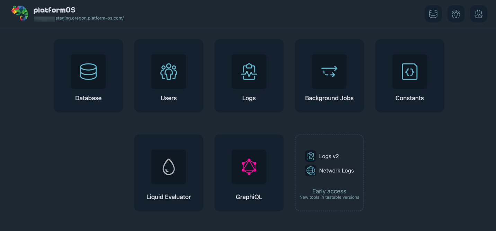
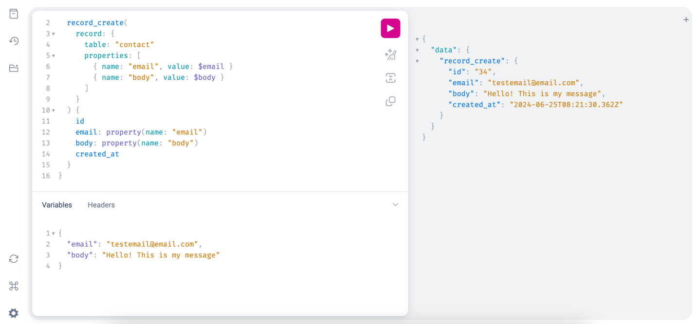

## Overview

**pos-cli** is a command-line interface (CLI) tool specifically developed to simplify the deployment of your configuration files and assets to platformOS. It requires a specific file structure to ensure correct communication with the platformOS API. While its use is not mandatory, it is **highly recommended**. Basic familiarity with command line environments, such as Terminal, is expected when using pos-cli.

If you encounter any issues, have feedback, or want to request new features, please go to our [issues page](https://github.com/mdyd-dev/pos-cli/issues) and let us know.

Run all commands from the project root directory, one level above the `app` or `modules` directory.

### Requirements

`pos-cli` requires Node.js version 22 or higher to function correctly. [See instructions for installing Node.js on your platform](https://nodejs.org/en/download/).

## Installation and Update

If Node.js is installed on your system for all users, you may need to use the `sudo` command to install npm packages globally:

    sudo npm install -g @platformos/pos-cli

If you're using nvm (Node Version Manager) or if Node.js is installed only for your user account, use:

    npm install -g @platformos/pos-cli

## Usage

### Adding Environments and Authenticating

To authenticate, you'll need your [**Partner Portal**](https://partners.platformos.com/) account credentials. If you don't have a Partner, follow the [Sign up on the Partner Portal guide](https://documentation.platformos.com/get-started/installation-and-configuration/#sign-up-on-the-partner-portal).

To add an environment to your configuration file, use the `env add` command and authenticate with your **Partner Portal** credentials:

    pos-cli env add [environment] --url [your application url] [optional: --partner-portal-url]

Examples: 

    pos-cli env add staging --url https://example.com
    pos-cli env add staging --url https://example.com --partner-portal-url https://portal.private-stack.online

The configuration for your environments is stored in the `.pos` file.

### Syncing Changes

To synchronize changes with your environment, use the following command:
    
    pos-cli sync [environment]

Example: `pos-cli sync staging`

Using this command activates **sync mode**, which immediately uploads any changes you make to your local file system to the specified environment. This offers an experience similar to working on a local server. However, because changes are applied instantly, using sync mode on a production environment or a live application is risky and not recommended. It's best to limit the use of this feature to staging environments where immediate updates can be tested safely.

#### Automatically Opening the Browser

Include the `--open` (`-o`) option with your sync command to automatically launch your Instance in the default web browser:

    pos-cli sync [environment] -o
    
#### Concurrency

By default, the `sync` command establishes three concurrent connections to our server for syncing resources and assets. You have the option to modify this to better suit your network's capabilities:

    pos-cli sync [environment] -c 10

Adjust the number of concurrent connections based on your specific requirements and connection strength.

#### Syncing a Single File

To sync a single file without entering watch mode, use the `-f` or `--file-path` option:

    pos-cli sync [environment] -f path/to/file.liquid

This command syncs only the specified file and exits immediately, making it useful for scripting where you need to update a specific file without keeping a persistent connection.

### Deploying Changes

To deploy all changes to a specified environment, use the following command:

    pos-cli deploy [environment]

Example: `pos-cli deploy staging`

It is recommended to first deploy changes to a staging environment, thoroughly test them there, and only then proceed with deploying to production. The deploy command packages all your files into a zip file and sends it to the API for background processing. Each zip file is stored, enabling rollback if any issues arise.

To skip the audit during deployment, set the environmental variable `CI` to `true`.

#### Dry Run

To validate your release on the server without applying any changes, use the `--dry-run` flag:

    pos-cli deploy [environment] --dry-run

Example: `pos-cli deploy staging --dry-run`

This uploads the release archive and runs server-side validation but does not apply any changes. The server reports which files would be upserted and which would be deleted, making it useful for previewing the impact of a deployment before committing to it. Assets are never uploaded during a dry run.

### Code Audit

To perform a static analysis of the files in your current application directory, use the following command:

    pos-cli audit

Example: `pos-cli audit`

This command checks your application files for issues using static analysis, helping you maintain code quality and identify potential errors.

### Liquid Code Quality Check

pos-cli provides a powerful Liquid code quality checker powered by platformos-check. This helps you catch issues early, enforce best practices, and maintain high-quality code.

#### Initialize Configuration

Before running checks, you can create a `.platformos-check.yml` configuration file to customize which checks to run:

    pos-cli check init [path]

Example: `pos-cli check init`

This creates a `.platformos-check.yml` file that:
- Extends the recommended platformos-check configuration
- Ignores `node_modules/**` by default
- Includes all available settings as comments for easy customization

#### Run Checks

To check your Liquid code quality, use:

    pos-cli check run [path]

Example: `pos-cli check run`

This command analyzes Liquid templates for common issues, syntax errors, and best practices violations. By default, it checks the current directory, but you can specify a path to check a specific directory.

The output includes:
- **Severity levels**: Errors, warnings, and info messages color-coded for easy identification
- **Code snippets**: Shows the actual problematic code with line numbers
- **Grouped by file**: Offenses are organized by file for better readability
- **Summary counts**: Total offenses broken down by severity

#### Options

- `-a` - Enable automatic fixing of issues where possible
- `-c, --check <name>` - Only show offenses from the named check (repeatable, e.g. `-c UndefinedObject -c UnusedAssign`)
- `-f <format>` - Output format: `text` (default) or `json`
- `-s, --silent` - Only show errors, no success messages

#### Examples

Check current directory:

    pos-cli check run

Check specific directory:

    pos-cli check run ./app/views

Auto-fix issues:

    pos-cli check run -a

JSON output for CI/CD:

    pos-cli check run -f json

Silent mode (no success message):

    pos-cli check run -s

Filter by specific check:

    pos-cli check run --check UndefinedObject

Filter by multiple checks:

    pos-cli check run -c UndefinedObject -c UnusedAssign

Combined options:

    pos-cli check run -a -f json

The command exits with code 0 if no issues are found, or 1 if issues are detected, making it suitable for CI/CD pipelines.

#### Output Format

**Text output** displays offenses grouped by file with code snippets:

```
3 offenses found in 1 file:
  3 warnings

app/views/pages/index.liquid

[warning] UndefinedObject
  Unknown object 'user' used.

   5  <p>{{ user.name }}</p>
```

**JSON output** provides structured data with severity counts:

```json
{
  "offenseCount": 3,
  "fileCount": 1,
  "errorCount": 0,
  "warningCount": 3,
  "infoCount": 0,
  "files": [
    {
      "path": "app/views/pages/index.liquid",
      "offenses": [...],
      "errorCount": 0,
      "warningCount": 3,
      "infoCount": 0
    }
  ]
}
```

#### Configuration File

After running `pos-cli check init`, you can customize `.platformos-check.yml`:

```yaml
extends: platformos-check:recommended
ignore:
  - node_modules/**
  - dist/**

# Customize individual checks
UndefinedObject:
  enabled: true
  severity: error  # error (0), warning (1), or info (2)

DeprecatedFilter:
  enabled: true
  severity: warning
```

The configuration file controls:
- Which checks are enabled/disabled
- Severity levels for each check
- File patterns to ignore
- Check-specific settings

#### Update Docs

To download the latest platformOS Liquid documentation used by the linter:

    pos-cli check update-docs

The linter automatically checks whether its cached documentation is stale and updates it when needed. However, if you want to be sure you have the latest platformOS filters, tags, objects, and schema, you can use this command to force a download.

### Language Server Protocol (LSP)

pos-cli includes a Language Server Protocol (LSP) server for platformOS Liquid, enabling rich editor support such as autocompletion, diagnostics, hover documentation, and go-to-definition in any LSP-compatible editor.

The server communicates over **stdio** (standard input/output), which is the standard LSP transport. You do not start it manually — your editor launches it automatically based on your configuration.

#### Configure Your Editor

Installing pos-cli globally (`npm install -g @platformos/pos-cli`) automatically places `pos-cli-lsp` on your PATH — no wrapper script needed. Configure your editor to use it as the language server.

##### Claude Code

Add the following to your Claude Code MCP/LSP configuration (typically `.claude/settings.json` or your global Claude Code settings):

```json
{
  "lsp": {
    "platformos-liquid": {
      "command": ["pos-cli-lsp"],
      "extensions": [".liquid", ".graphql", ".json"]
    }
  }
}
```

##### Open Code (open-vsx / VSCodium-compatible editors)

Add the following to your editor's `settings.json` (`Ctrl+Shift+P` → "Open User Settings (JSON)"):

```json
{
  "lsp": {
    "platformos-liquid": {
      "command": ["pos-cli-lsp"],
      "extensions": [".liquid", ".graphql", ".json"]
    }
  }
}
```

#### Supported File Types

The language server provides IDE features for:

- `.liquid` — platformOS Liquid templates
- `.graphql` — GraphQL queries and mutations
- `.json` — platformOS configuration files

#### Features

Once configured, the language server provides:

- **Autocompletion** — Liquid tags, filters, and platformOS-specific variables
- **Diagnostics** — Real-time error and warning highlighting
- **Hover documentation** — Inline docs for tags and filters
- **Go-to-definition** — Navigate to template, partial, and schema definitions

### Reading Logs

Use the `logs` command to access errors and logs that you or the system logs:

    pos-cli logs [environment]

Read more on [how to create logs](https://documentation.platformos.com/api-reference/liquid/platformos-tags#log).

Once activated, this command continuously displays logs as long as it is running. If supported by your operating system, errors will also trigger system notifications.

You can filter logs displayed by specifying a type with the  `--filter` argument.

    pos-cli logs [environment] --filter type

Example:

    pos-cli logs staging --filter debug

This command filters and displays only the logs of type 'debug' from the staging environment.

For more details, [read our documentation on logs](https://documentation.platformos.com/api-reference/liquid/platformos-tags#log).

### Logs V2

#### LOGS

examples:

    pos-cli logsv2 search stg --size 5 --from 0

    pos-cli logsv2 search stg --sql "select *  from logs" --json | jq

    pos-cli logsv2 search stg --sql "select message,type  from logs" --json | jq

    pos-cli logsv2 search stg --sql "select * from logs where str_match(message, 'com')" --start_time 1694694303000000 --size 5 | jq


    
#### ROADMAP
- alerts
- alerts delete 
- better errors
- GUI

### Listing environments

If you need to recall the names of your environments or their corresponding URLs, use the following command:

    pos-cli env list

### Initializing the directory structure

To start a new project from scratch and set up the initial directory structure, use the `init` command:

    pos-cli init --url mdyd-dev/directory-structure --branch master

Default URL: `mdyd-dev/directory-structure`
Default branch: `master`

The `init` command uses [degit](https://github.com/Rich-Harris/degit) to download the directory structure from the specified Git repository and extract it into your current directory. It supports all file formats that degit can handle, simplifying the setup process for new projects.

### Managing Constants

Add constant named `API_KEY` with value `abc123` on `dev` environment:

    pos-cli constants set --name API_KEY --value abc123 dev

Remove constant `API_KEY` on `staging` environment:

    pos-cli constants unset --name API_KEY staging

List defined constants without exposing their values on `production` environment:

    pos-cli constants list production


    SECRETTOKEN                                        "XX..."
    TEMP_TOKEN                                         "XX..."
    USE_SEARCH_INDEX                                   "tr..."

List defined constants showing their values on `production` environment:

    SAFE=1 pos-cli constants list production


    SECRETTOKEN                                        "XXXXXXX"
    TEMP_TOKEN                                         "XXXXXXXXXXXXXX"
    USE_SEARCH_INDEX                                   "true"


### Modules

#### List

Use the following command to display all modules that have been installed through the Partners Portal for a specific environment:

    pos-cli modules list [environment]

**Note:** This command does not list modules that you deployed manually via the `modules/` directory. For example, if you create a directory manually, such as `modules/my-module`, and add a file like `modules/my-module/public/views/partials/my-partial.liquid`, `my-module` will not appear in the list produced by this command.

However, if you install a module using the `pos-cli modules install another-module` command or directly through the "Install" option in the Partners Portal interface, the module will be listed by this command.

#### Initialiting a New Module

To create a new module using a template from a starter repository, use the following command, where `<module name>` is your desired module name:

    pos-cli modules init <module name>

This command sets up a new directory within the `modules/` folder, pulling the initial structure and content from the [Platform-OS module template repository](https://github.com/Platform-OS/pos-module-template).

Example of creating a module named "new":
    ~/projects/pos/modules/pos-module-new pos-cli modules init new
    [11:02:21] Module directory structure successfully created.

After running the command, you can see the new module directory has been created by listing the contents:

    ~/projects/pos/modules/pos-module-new ls
    modules
    ~/projects/pos/modules/pos-module-new cd modules
    ~/projects/pos/modules/pos-module-new/modules ls
    new
    ~/projects/pos/modules/pos-module-new/modules cd new
    ~/projects/pos/modules/pos-module-new/modules/new ls
    CHANGELOG.md  changelog-template.hbs  LICENSE  package.json  private  public  pull_request_template.md  README.md  template-values.json

#### Installation

Install modules published in the modules marketplace. The `install` command adds the module to `pos-module.json`, resolves all transitive dependencies, writes `pos-module.lock.json`, and downloads all module files into the `modules/` directory.

**Two files, two purposes:**

- `pos-module.json` — your declared intent. Edit this file to express which modules you want and at what version constraints. Commit it to source control.
- `pos-module.lock.json` — auto-generated. Records the exact resolved version of every module and its transitive dependencies, plus the registry URL each module was resolved from. Commit this too so teammates and CI get identical installs.

**Installing a module**

    # Install latest stable — stores a caret range (e.g. ^2.0.0) in pos-module.json
    pos-cli modules install core

    # Install with a caret range — allows any compatible 2.x release
    pos-cli modules install core@^2.0.0

    # Install with a tilde range — allows patch-level updates only (2.1.x)
    pos-cli modules install core@~2.1.0

    # Install an exact version — no automatic updates
    pos-cli modules install core@2.1.5

    # Re-resolve and download everything declared in pos-module.json (e.g. after cloning)
    pos-cli modules install

    # Add a module to devDependencies instead of dependencies
    pos-cli modules install tests --dev

    # CI mode — use pos-module.lock.json as-is, no registry resolution. Fails fast if the lock file is missing or stale.
    pos-cli modules install --frozen

    # CI mode including devDependencies
    pos-cli modules install --frozen --dev

**Version range syntax**

| Syntax | Example | What gets installed |
|--------|---------|---------------------|
| No version | `install core` | Latest stable; stores `^MAJOR.0.0` |
| Caret `^` | `^2.0.0` | Highest `2.x.x` release (`>=2.0.0 <3.0.0`) |
| Tilde `~` | `~2.1.0` | Highest `2.1.x` patch release (`>=2.1.0 <2.2.0`) |
| Exact | `2.1.5` | Exactly `2.1.5`, never updated automatically |
| Greater-or-equal | `>=2.0.0` | Highest stable `2.0.0` or above |
| Range | `>=2.0.0 <3.0.0` | Highest stable within the bounds |

**Updating modules**

    # Re-resolve all modules — range entries re-resolve to latest within their range; exact pins are unchanged
    pos-cli modules update

    # Update a single module to its latest stable (or latest within its stored range)
    pos-cli modules update core

    # Change a module's constraint to a new range
    pos-cli modules update core@^3.0.0

    # Pin a module to a specific version
    pos-cli modules update core@3.1.0

    # Re-resolve devDependencies along with dependencies
    pos-cli modules update --dev

**Key difference between `install` and `update`:**

- `install core` when `core` is already in `pos-module.json` → **no-op** on the constraint; dependencies are still re-resolved and any missing files downloaded.
- `update core` when `core` has an exact pin → always fetches the latest stable release and updates the pin.
- `update core` when `core` has a range (e.g. `^2.0.0`) → re-resolves to the latest within that range; the range itself is unchanged in `pos-module.json`.

After installing or updating, deploy to apply the changes to your instance:

    pos-cli deploy <env>

#### Show available versions

Display all versions of a module published in the registry:

    pos-cli modules show <module-name>

#### Uninstall

Remove a module from your local project. This removes the entry from `pos-module.json`, re-resolves the dependency tree, updates `pos-module.lock.json`, and removes the module's files from `modules/`:

    pos-cli modules uninstall <module-name>

    # Remove from devDependencies
    pos-cli modules uninstall <module-name> --dev

To remove a module from a deployed instance (different from local uninstall):

    pos-cli modules remove [environment] <module name>

#### Migrate to the new manifest format

If your project still uses the legacy `app/pos-modules.json` (or has metadata fields like `machine_name`/`version` inside `template-values.json`), migrate to the unified `pos-module.json`:

    pos-cli modules migrate

The migration runs two independent, idempotent phases:

- **Phase A** — converts `app/pos-modules.json` → `pos-module.json` (`modules` key → `dependencies`).
- **Phase B** — lifts `machine_name`, `version`, `name`, `repository_url` from `modules/<name>/template-values.json` into `pos-module.json` and strips them from the source file (deleting the file if it becomes empty).

When multiple `modules/<name>/template-values.json` files exist, target a specific module:

    pos-cli modules migrate --name <machine_name>

#### Per-module registry overrides

By default, `install` and `update` resolve modules from the public registry (overridable via `PARTNER_PORTAL_HOST`). To resolve specific modules from a private or custom registry, declare a `registries` map in `pos-module.json`:

```json
{
  "name": "My App",
  "dependencies": {
    "core": "^1.5.0",
    "private-module": "^1.0.0"
  },
  "registries": {
    "private-module": "https://portal.private-stack.online"
  }
}
```

After each `install`/`update`, every resolved module gets its registry URL stamped into `pos-module.lock.json`, making the lock file self-contained for `--frozen` mode.

#### Publishing

To publish a module to our module repository, 
1. [Create the module on the Partner Portal](https://partners.platformos.com/pos_modules/new) and give it a unique name.
2. Create a separate directory for your module and run `pos-cli init <module_name>` to create necessary directory structure.

    mkdir <module_name>; cd <module_name>
    pos-cli init <module_name>

3. After preparing your module, release the new version and then publish it:

    # Bump using a semver type (major | minor | patch). Defaults to `patch` when no argument is given.
    pos-cli modules version patch

    # …or set an explicit version
    pos-cli modules version 1.2.3

    pos-cli modules push --email <your_email>

`pos-cli modules version` updates `pos-module.json`, syncs the version into `modules/<name>/template-values.json` (when present), and creates a git commit and tag. The command refuses to run on a dirty working tree; use `--no-git` to skip the commit and tag.

To package the module into a release archive without uploading (e.g. for inspection or manual publishing):

    pos-cli modules build

#### Pulling module codebase

Fetch the codebase of a module that is deployed on your instance:

    pos-cli modules pull <env> <module_name>

This will download and unpack module files into the `modules/<module_name>` directory.

##### Module Templates

Templates automate and simplify the configuration process in module management. For example, upon installing a module, it is possible to specify URIs under which pages will be available after the module has been installed. This functionality is supported in both sync and deploy modes.

The templates use ERB/EJS-style markup (`<%=` `=%>`). with a simple filter `&` to unescape user-provided values. By default, all values are escaped.

To specify variable values, place them in the `template-values.json` within the root module directory. You can also specify the path to this configuration file using the `TEMPLATE_VALUES_FILE_PATH` variable. For example, by executing `TEMPLATE_VALUES_FILE_PATH=templates/values.json pos-cli deploy staging` the `templates/values.json` file will be used as values for templates:

    TEMPLATE_VALUES_FILE_PATH=templates/values.json pos-cli deploy staging

Directory structure with `template-values.json`:

```shell
modules
└──admincms
    ├── template-values.json
    ├── private
    │   └── graphql
    │       ├── get_models.graphql
    │       └── get_pages.graphql
    └── public
        └── views
            └── pages
                └── admin.liquid
```

**Template Usage Example:**

A page with this code

```yaml
---
slug: <%= &desired_location =%>
---

This is using templates <%= what =%> !
```

An example `template-values.json`:

```json
{
  "desired_location": "index",
  "what": "magic"
}
```

Will result during deploy/sync in:

```yaml
---
slug: index
---

This is using templates magic!
```

### Migrations

Migrations are files that contain executable Liquid code (including GraphQL) code, which you can run across different environments. These files also enable you to keep a record of what scripts have been executed, making it easier to track changes and updates.

This is particularly useful if you want to execute the same code on multiple environments after the code has been deployed, like seeding databases with initial data.

For detailed information:
* Read our documentation on [Migrations](https://documentation.platformos.com/developer-guide/platformos-workflow/directory-structure#migrations)
* or follow the [step-by-step guide on Migrating Data](https://documentation.platformos.com/developer-guide/data-import-export/migrating-data).


#### List

List all migrations that have been deployed to the server, along with their current status:

    pos-cli migrations list [environment] [name]

#### Generate

To create a new migration, use the `generate` command with a specified name. A timestamp is automatically prepended to the name to ensure that migrations are executed in the order they were created:

    pos-cli migrations generate [environment] [name]

Migrations are executed automatically during deployment.

#### Run

To execute a migration manually, use the `run` command. Before running a migration, ensure that the migration file has been synchronized with the intended environment.

The migration is identified by the filename without the extension, or simply by the timestamp.

    pos-cli migrations run [environment] [name]

Example:

    pos-cli migrations run staging 20190715132951_update_admin_password

This command manually runs a specific migration script that updates an admin password in the staging environment.

### DNS (migrating domains between Partner Portals)

The `dns` commands move an instance's custom domains and DNS records between two Partner Portal deployments (for example from `partners.platformos.com` to a private-stack portal). They talk to both portals' `/api/domains` API using the tokens stored in your `.pos` environments (each environment remembers its own `partner_portal_url`), so both the source and the target environment must be registered with `pos-cli env add` — or you can pass `--source-*`/`--target-*` flags (`-portal-url`, `-token`, `-email`, `-instance-uuid`) instead.

Only your own records are migrated: platform-managed DNS (load-balancer targets, SSL validation entries, the www-redirect record) is re-created by the target portal automatically.

#### Export

Save all domains and DNS records of an instance to a versioned JSON file — a backup/audit artifact that `import` and `compare` also accept as input:

    pos-cli dns export [environment]
    pos-cli dns export [environment] -o backup.json
    pos-cli dns export [environment] --instances-file uuids.txt -o exports/   # bulk, one file per instance

#### Migrate

Export from the source portal, transform, apply to the target portal, and print per-domain cutover instructions (which nameservers or verification records to set where). The source portal is only ever read, and a backup export file is always written before anything is applied:

    pos-cli dns migrate [sourceEnv] [targetEnv] --dry-run    # review the plan first
    pos-cli dns migrate [sourceEnv] [targetEnv]

After the plan is displayed you are asked to confirm before anything is applied — pass `--yes` to skip the prompt (required in scripts/CI). `partners.platformos.com` is protected as read-only: it can only ever be a migration *source*, so an accidental argument swap (`migrate target source`) fails immediately instead of writing to the legacy production portal.

Domains end up in `ownership_verification_pending` until you complete the printed cutover steps (repoint nameservers at your registrar for `domain-full`, or add the verification records and repoint your CNAME/A for `domain-external`). That state is expected before cutover, not an error.

Useful options: `--domain <name>` (repeatable) migrates selected domains only; `--confirm-destructive` is required when an update would delete many records already managed on the target; `--mapping-file pairs.csv` (`source_uuid,target_uuid[,label]`) or `--instances-file uuids.txt --match-by-domain` migrate a whole cohort of instances.

#### Status

Show each provisioned domain's status and any pending cutover steps (in case they were missed after a migrate):

    pos-cli dns status [environment]
    pos-cli dns status [environment] --domain example.com

#### Import

Apply a previously exported file to a portal (same transform and safety rules as `migrate`):

    pos-cli dns import [environment] --file backup.json --dry-run
    pos-cli dns import [environment] --file backup.json

#### Compare

Verify DNS parity between the two sides — exits non-zero when a domain differs in a way that matters (status, setup type, record intent). Expected cross-stack differences (data centers, nameservers, MX case, TXT chunking, and records whose name one DNS provider stores fully-qualified and another stores short, e.g. SRV records moving from Route53 to Cloudflare) are filtered out; `--raw` compares byte-for-byte instead:

    pos-cli dns compare [sourceEnv] [targetEnv]
    pos-cli dns compare [sourceEnv] [targetEnv] --ignore-status    # before cutover
    pos-cli dns compare --source-file before.json --target-file after.json   # offline

If the migration dropped records with `--drop-value`, pass the same patterns to `compare` so those records are excluded from the parity check instead of reporting as missing forever.

The intended sequence is: `migrate` → complete the cutover steps → refresh validation from the target portal → `compare` comes back clean.

#### Exit codes

`import` and `migrate` (single and bulk modes alike): `0` success, `1` apply errors, `2` transform errors, `3` only destructive-blocked domains remain. `compare`: `0` parity, `1` any CRITICAL or missing domain. Dry-runs exit `0` (or `2` when the plan contains transform errors).

### Data

#### Export

This function allows you to export data from your environment to a specified file in JSON format.

Command:

    pos-cli data export staging --path=data.json

For more comprehensive guidance on exporting data using the CLI, REST API, and GraphQL, read our documentation on [Data Export](https://documentation.platformos.com/developer-guide/data-import-export/export).

#### Import

Use this command to import data from a JSON file that follows the proper data structure into your environment:

    pos-cli data import staging --path=data.json

For detailed instructions on importing data with different technologies, read our documentation on [Data Import Using CSV format](https://documentation.platformos.com/developer-guide/data-import-export/import).

#### Clean Data (Staging Only)

This command removes data entries from your Instance without altering the underlying data structure: 

    pos-cli data clean staging
    
For example, if your model schema is `car` and it contains 10 entries, this operation will remove these entries but the `car` schema itself will remain intact.

This function is particularly useful for clearing data when testing your imports/exports, or for resetting your database to a fresh state between tests.

**Important:** This operation is irreversible. The pos-cli will request confirmation twice before proceeding to ensure that you do not accidentally remove data.


### Admin - Graphical Interface (GUI)

To start the local HTTP server that hosts the GUI, execute the following command:

    pos-cli gui serve [environment]

Example: `pos-cli gui serve staging`

You can access the platformOS Admin GUI by visiting [http://localhost:3333](http://localhost:3333).



#### Working with Multiple Local Instances

If you are working on multiple platformOS environments or projects, you can run several instances simultaneously by setting different port numbers for each instance. This is useful when you need to develop or test multiple environments.

By default, the platformOS Admin GUI runs on `http://localhost:3333`. To work on multiple environments simultaneously, you can specify different ports using the `--port` flag. For example, to serve the `staging` environment on port `3337`, use:

```bash
pos-cli gui serve staging --port 3337
```

This allows you to access the staging environment at `http://localhost:3337`, while leaving the default port available for other instances. You can repeat this with other environments by assigning unique port numbers.

#### Opening Admin Automatically 

If you want to open the platformOS Admin in your browser when the GUI server starts (as soon as `gui serve` is running), include `--open` (`-o`) in your command:

    pos-cli gui serve [environment] -o
    
#### Syncing with GUI

For routine tasks, you might want both the GUI server (`gui serve`) and data synchronization (`sync`) to run simultaneously. You can achieve this with a single command:

    pos-cli gui serve [environment] -o --sync

#### Exploring with GraphiQL Browser

To interact with your instance's database using GraphQL, navigate to the GraphiQL interface at in your web browser:

[http://localhost:3333/gui/graphql](http://localhost:3333/gui/graphql)



The sidebar includes schema documentation for reference.

#### Liquid Evaluator

For experimenting and evaluating Liquid templates directly on your Instance, access the Liquid evaluator page in your browser:

[http://localhost:3333/gui/liquid](http://localhost:3333/gui/liquid)

This interface allows you to test and refine Liquid code within the context of your platformOS environment.

### Generators

Generators are tools that allow you to quickly create files necessary for your project. You can use generators from platformOS modules or create your own custom generators in any directory.

The tool automatically handles dependency installation - if your generator has a `package.json`, dependencies will be installed automatically when needed.

#### Using Module Generators

For example, the [core module](https://github.com/Platform-OS/pos-modules/tree/master/pos-module-core) includes a `command` generator for creating command files:

    pos-cli generate modules/core/generators/command users/create

The `crud` generator creates a complete CRUD setup with schema, GraphQL, commands, and optionally views:

    pos-cli generate modules/core/generators/crud product name:string price:integer --includeViews

#### Using Custom Generators

You can create and use generators from any directory in your project:

    pos-cli generate my/custom/generator arg1 arg2

Custom generators should:
- Have an `index.js` file that exports a Yeoman generator class
- Optionally include a `package.json` with dependencies (will be auto-installed)
- Follow the [yeoman-generator v7 API](https://yeoman.github.io/generator/)

#### Generator Help

For any generator, you can access help documentation with the `--generator-help` flag:

    pos-cli generate modules/core/generators/command --generator-help
    pos-cli generate my/custom/generator --generator-help

This displays available arguments, options, and usage examples for the generator.

### Executing Code

#### Execute Liquid

Execute Liquid code directly on your instance:

    pos-cli exec liquid [environment] [code]

Example:

    pos-cli exec liquid staging "{{ 'hello' | upcase }}"

You can also execute Liquid code from a file using the `-f` flag:

    pos-cli exec liquid staging -f path/to/script.liquid

#### Execute GraphQL

Execute GraphQL queries directly on your instance:

    pos-cli exec graphql [environment] [query]

Example:

    pos-cli exec graphql staging "{ users(per_page: 5) { results { id email } } }"

You can also execute GraphQL from a file using the `-f` flag:

    pos-cli exec graphql staging -f path/to/query.graphql

Pass GraphQL variables as a JSON object with the `-p, --params` flag:

    pos-cli exec graphql staging 'query q($id: ID) { record(id: $id) { id } }' --params '{"id":"42"}'

The `--params` flag can be combined with `-f` to supply variables for a query read from a file:

    pos-cli exec graphql staging -f path/to/query.graphql --params '{"id":"42"}'

**Note:** When executing on production environments (environment name contains "prod" or "production"), you will be prompted for confirmation before execution.

### Running Tests

To run tests on your instance, you need to have the [tests module](https://github.com/Platform-OS/pos-modules/tree/master/pos-module-tests) installed.

#### Run All Tests

    pos-cli test run [environment]

Example:

    pos-cli test run staging

This command runs all tests and streams the results in real-time, showing individual test outcomes and a summary at the end.

#### Run a Single Test

    pos-cli test run [environment] [test-name]

Example:

    pos-cli test run staging my_test

### MCP Server (AI Integration)

pos-cli includes a built-in [Model Context Protocol (MCP)](https://modelcontextprotocol.io/) server that exposes platformOS operations as tools for AI clients such as Claude, Cursor, and other MCP-compatible assistants. This lets AI agents deploy code, run GraphQL queries, manage data, execute migrations, and more — all directly against your platformOS instances.

#### Quick setup: pos-cli ai init

The fastest way to connect your AI tool is the one-step wizard:

    pos-cli ai init

It asks which AI tool you use and registers both platformOS MCP servers — `platformos` (the pos-cli tools listed below) and `platformos-supervisor` (Liquid/GraphQL/YAML code validation via `validate_code`) — in that tool's project-scoped configuration:

| Tool        | Configuration file  | Key          |
| ----------- | ------------------- | ------------ |
| Claude Code | `.mcp.json`         | `mcpServers` |
| Cursor      | `.cursor/mcp.json`  | `mcpServers` |
| VS Code     | `.vscode/mcp.json`  | `servers`    |
| Other       | prints the JSON snippet for manual setup | — |

Run it from your project root. Existing configuration files are merged, never overwritten — other MCP servers and unrelated settings are preserved, and re-running the command is a no-op. To skip the prompt (e.g. in scripts), pass the tool directly:

    pos-cli ai init --tool claude

#### Starting the MCP Server

    pos-cli mcp

This starts both a **stdio transport** (for editor/AI integrations) and an **HTTP/SSE server** on port 5910 (configurable with `MCP_MIN_PORT`).

#### Configuring Claude Code

Run `pos-cli ai init --tool claude` to generate this automatically, or add the following to a `.mcp.json` file at your project root:

```json
{
  "mcpServers": {
    "platformos": {
      "command": "pos-cli-mcp"
    },
    "platformos-supervisor": {
      "command": "pos-cli-supervisor"
    }
  }
}
```

Both commands are installed globally with pos-cli (`npm install -g @platformos/pos-cli`).

#### Supervisor MCP server (pos-cli-supervisor)

    pos-cli-supervisor [--project <dir>]

Starts the [platformOS MCP supervisor](https://github.com/Platform-OS/platformos-tools/tree/master/packages/platformos-mcp-supervisor) — a stdio-only MCP server exposing a single `validate_code` tool that lets AI agents validate platformOS Liquid, GraphQL, and YAML files *before* writing them. It returns structured errors, warnings, proposed fixes, and a `must_fix_before_write` gate.

The project directory is resolved from `--project`, then the `POS_SUPERVISOR_PROJECT_DIR` environment variable, then the current working directory (which is what MCP clients use when launched via `pos-cli ai init`). All logging goes to stderr — stdout is reserved for the MCP protocol.

#### Available Tools

The MCP server exposes 30+ tools across these categories:

- **Environments**: `envs-list`, `env-add`
- **Deploy**: `deploy-start`, `deploy-status`, `deploy-wait`
- **Sync**: `sync-file`
- **Logs**: `logs-fetch`
- **GraphQL**: `graphql-exec`
- **Liquid**: `liquid-exec`
- **Data**: `data-import`, `data-import-status`, `data-export`, `data-export-status`, `data-clean`, `data-clean-status`, `data-validate`
- **Migrations**: `migrations-list`, `migrations-generate`, `migrations-run`
- **Tests**: `unit-tests-run`, `tests-run-async`, `tests-run-async-result`
- **Constants**: `constants-list`, `constants-set`, `constants-unset`
- **Generators**: `generators-list`, `generators-help`, `generators-run`
- **Code quality**: `check-run`
- **Uploads**: `uploads-push`
- **Partner Portal**: `instance-create`, `partners-list`, `partner-get`, `endpoints-list`

#### Viewing Tool Configuration

To see which tools are enabled or disabled:

    pos-cli mcp-config

Use `--json` for raw JSON output. You can override the configuration by setting the `MCP_TOOLS_CONFIG` environment variable to point to a custom `tools.config.json` file.

### Fetching Logs (Machine-Readable)

For scripting and CI pipelines that need logs in a structured format, use `fetch-logs`:

    pos-cli fetch-logs [environment]

This outputs logs as newline-delimited JSON (NDJSON), one log entry per line:

```json
{"id":"1001","message":"Hello","type":"debug","created_at":"2026-01-01T12:00:00Z"}
{"id":"1002","message":"World","type":"info","created_at":"2026-01-01T12:00:01Z"}
```

Each entry contains an `id` field. Pass the highest `id` from a previous run to `--last-log-id` to fetch only newer logs on the next poll:

    pos-cli fetch-logs staging --last-log-id 1002

## Development

The `pos-cli gui serve` command uses a distinct build process for the GraphiQL interface located in the `gui/editor/graphql` directory.

### Setting Up Development Environment

To prepare for development, you first need to install all necessary dependencies:

    npm ci

Then, you can start the development environment by executing:

    npm start

### Building and Committing Changes

Once your development work is done, the next step is to build the production assets to ensure everything is optimized for deployment:

    npm run build

After building the production assets, make sure to commit your changes to the repository.
