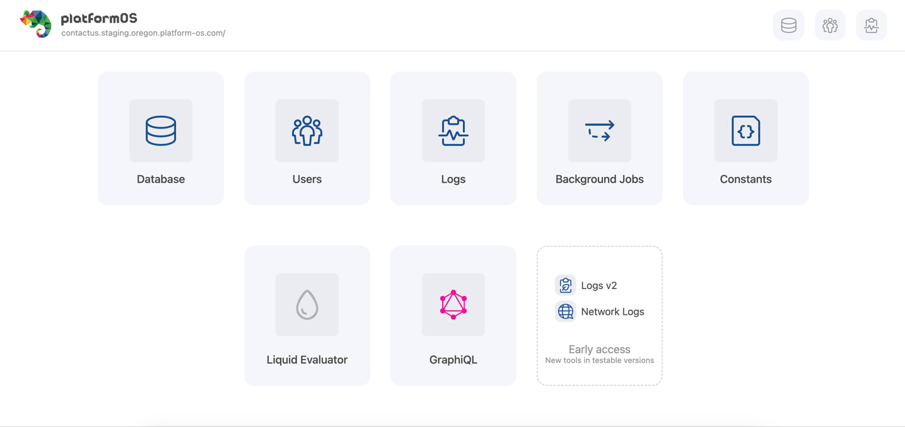

## Overview

**pos-cli** is a command-line interface (CLI) tool specifically developed to simplify the deployment of your configuration files and assets to platformOS. It requires a specific file structure to ensure correct communication with the platformOS API. While its use is not mandatory, it is **highly recommended**. Basic familiarity with command line environments, such as Terminal, is expected when using pos-cli.

If you encounter any issues, have feedback, or want to request new features, please go to our [issues page](https://github.com/mdyd-dev/pos-cli/issues) and let us know.

Run all commands from the project root directory, one level above the `app` or `modules` directory.

### Requirements

`pos-cli` requires Node.js version 22 or higher to function correctly. [See instructions for installing Node.js on your platform](https://nodejs.org/en/download/).

## Installation and Update

If Node.js is installed on your system for all users, you may need to use the `sudo` command to install npm packages globally:

    sudo npm install -g @platformos/pos-cli

If you're using nvm (Node Version Manager) or if Node.js is installed only for your user account, use:

    npm install -g @platformos/pos-cli

## Usage

### Adding Environments and Authenticating

To authenticate, you'll need your [**Partner Portal**](https://partners.platformos.com/) account credentials. If you don't have a Partner, follow the [Sign up on the Partner Portal guide](https://documentation.platformos.com/get-started/installation-and-configuration/#sign-up-on-the-partner-portal).

To add an environment to your configuration file, use the `env add` command and authenticate with your **Partner Portal** credentials:

    pos-cli env add [environment] --url [your application url] [optional: --partner-portal-url]

Examples: 

    pos-cli env add staging --url https://example.com
    pos-cli env add staging --url https://example.com --partner-portal-url https://portal.private-stack.online

The configuration for your environments is stored in the `.pos` file.

### Syncing Changes

To synchronize changes with your environment, use the following command:
    
    pos-cli sync [environment]

Example: `pos-cli sync staging`

Using this command activates **sync mode**, which immediately uploads any changes you make to your local file system to the specified environment. This offers an experience similar to working on a local server. However, because changes are applied instantly, using sync mode on a production environment or a live application is risky and not recommended. It's best to limit the use of this feature to staging environments where immediate updates can be tested safely.

#### Automatically Opening the Browser

Include the `--open` (`-o`) option with your sync command to automatically launch your Instance in the default web browser:

    pos-cli sync [environment] -o
    
#### Concurrency

By default, the `sync` command establishes three concurrent connections to our server for syncing resources and assets. You have the option to modify this to better suit your network's capabilities:

    pos-cli sync [environment] -c 10

Adjust the number of concurrent connections based on your specific requirements and connection strength.

#### Syncing a Single File

To sync a single file without entering watch mode, use the `-f` or `--file-path` option:

    pos-cli sync [environment] -f path/to/file.liquid

This command syncs only the specified file and exits immediately, making it useful for scripting where you need to update a specific file without keeping a persistent connection.

### Deploying Changes

To deploy all changes to a specified environment, use the following command:

    pos-cli deploy [environment]
    
Example: `pos-cli deploy staging`

It is recommended to first deploy changes to a staging environment, thoroughly test them there, and only then proceed with deploying to production. The deploy command packages all your files into a zip file and sends it to the API for background processing. Each zip file is stored, enabling rollback if any issues arise.

To skip the audit during deployment, set the environmental variable `CI` to `true`.

### Code Audit

To perform a static analysis of the files in your current application directory, use the following command:

    pos-cli audit

Example: `pos-cli audit`

This command checks your application files for issues using static analysis, helping you maintain code quality and identify potential errors.

### Liquid Code Quality Check

pos-cli provides a powerful Liquid code quality checker powered by platformos-check. This helps you catch issues early, enforce best practices, and maintain high-quality code.

#### Initialize Configuration

Before running checks, you can create a `.platformos-check.yml` configuration file to customize which checks to run:

    pos-cli check init [path]

Example: `pos-cli check init`

This creates a `.platformos-check.yml` file that:
- Extends the recommended platformos-check configuration
- Ignores `node_modules/**` by default
- Includes all available settings as comments for easy customization

#### Run Checks

To check your Liquid code quality, use:

    pos-cli check run [path]

Example: `pos-cli check run`

This command analyzes Liquid templates for common issues, syntax errors, and best practices violations. By default, it checks the current directory, but you can specify a path to check a specific directory.

The output includes:
- **Severity levels**: Errors, warnings, and info messages color-coded for easy identification
- **Code snippets**: Shows the actual problematic code with line numbers
- **Grouped by file**: Offenses are organized by file for better readability
- **Summary counts**: Total offenses broken down by severity

#### Options

- `-a` - Enable automatic fixing of issues where possible
- `-f <format>` - Output format: `text` (default) or `json`
- `-s, --silent` - Only show errors, no success messages

#### Examples

Check current directory:

    pos-cli check run

Check specific directory:

    pos-cli check run ./app/views

Auto-fix issues:

    pos-cli check run -a

JSON output for CI/CD:

    pos-cli check run -f json

Silent mode (no success message):

    pos-cli check run -s

Combined options:

    pos-cli check run -a -f json

The command exits with code 0 if no issues are found, or 1 if issues are detected, making it suitable for CI/CD pipelines.

#### Output Format

**Text output** displays offenses grouped by file with code snippets:

```
3 offenses found in 1 file:
  3 warnings

app/views/pages/index.liquid

[warning] UndefinedObject
  Unknown object 'user' used.

   5  <p>{{ user.name }}</p>
```

**JSON output** provides structured data with severity counts:

```json
{
  "offenseCount": 3,
  "fileCount": 1,
  "errorCount": 0,
  "warningCount": 3,
  "infoCount": 0,
  "files": [
    {
      "path": "app/views/pages/index.liquid",
      "offenses": [...],
      "errorCount": 0,
      "warningCount": 3,
      "infoCount": 0
    }
  ]
}
```

#### Configuration File

After running `pos-cli check init`, you can customize `.platformos-check.yml`:

```yaml
extends: platformos-check:recommended
ignore:
  - node_modules/**
  - dist/**

# Customize individual checks
UndefinedObject:
  enabled: true
  severity: error  # error (0), warning (1), or info (2)

DeprecatedFilter:
  enabled: true
  severity: warning
```

The configuration file controls:
- Which checks are enabled/disabled
- Severity levels for each check
- File patterns to ignore
- Check-specific settings

### Reading Logs

Use the `logs` command to access errors and logs that you or the system logs:

    pos-cli logs [environment]

Read more on [how to create logs](https://documentation.platformos.com/api-reference/liquid/platformos-tags#log).

Once activated, this command continuously displays logs as long as it is running. If supported by your operating system, errors will also trigger system notifications.

You can filter logs displayed by specifying a type with the  `--filter` argument.

    pos-cli logs [environment] --filter type

Example:

    pos-cli logs staging --filter debug

This command filters and displays only the logs of type 'debug' from the staging environment.

For more details, [read our documentation on logs](https://documentation.platformos.com/api-reference/liquid/platformos-tags#log).

### Logs V2

#### LOGS

examples:

    pos-cli logsv2 search stg --size 5 --from 0

    pos-cli logsv2 search stg --sql "select *  from logs" --json | jq

    pos-cli logsv2 search stg --sql "select message,type  from logs" --json | jq

    pos-cli logsv2 search stg --sql "select * from logs where str_match(message, 'com')" --start_time 1694694303000000 --size 5 | jq


    
#### ROADMAP
- alerts
- alerts delete 
- better errors
- GUI

### Listing environments

If you need to recall the names of your environments or their corresponding URLs, use the following command:

    pos-cli env list

### Initializing the directory structure

To start a new project from scratch and set up the initial directory structure, use the `init` command:

    pos-cli init --url mdyd-dev/directory-structure --branch master

Default URL: `mdyd-dev/directory-structure`
Default branch: `master`

The `init` command uses [degit](https://github.com/Rich-Harris/degit) to download the directory structure from the specified Git repository and extract it into your current directory. It supports all file formats that degit can handle, simplifying the setup process for new projects.

### Managing Constants

Add constant named `API_KEY` with value `abc123` on `dev` environment:

    pos-cli constants set --name API_KEY --value abc123 dev

Remove constant `API_KEY` on `staging` environment:

    pos-cli constants unset --name API_KEY staging

List defined constants without exposing their values on `production` environment:

    pos-cli constants list production


    SECRETTOKEN                                        "XX..."
    TEMP_TOKEN                                         "XX..."
    USE_SEARCH_INDEX                                   "tr..."

List defined constants showing their values on `production` environment:

    SAFE=1 pos-cli constants list production


    SECRETTOKEN                                        "XXXXXXX"
    TEMP_TOKEN                                         "XXXXXXXXXXXXXX"
    USE_SEARCH_INDEX                                   "true"


### Modules

#### List

Use the following command to display all modules that have been installed through the Partners Portal for a specific environment:

    pos-cli modules list [environment]

**Note:** This command does not list modules that you deployed manually via the `modules/` directory. For example, if you create a directory manually, such as `modules/my-module`, and add a file like `modules/my-module/public/views/partials/my-partial.liquid`, `my-module` will not appear in the list produced by this command.

However, if you install a module using the `pos-cli modules install another-module` command or directly through the "Install" option in the Partners Portal interface, the module will be listed by this command.

#### Initialiting a New Module

To create a new module using a template from a starter repository, use the following command, where `<module name>` is your desired module name:

    pos-cli modules init <module name>

This command sets up a new directory within the `modules/` folder, pulling the initial structure and content from the [Platform-OS module template repository](https://github.com/Platform-OS/pos-module-template).

Example of creating a module named "new":
    ~/projects/pos/modules/pos-module-new pos-cli modules init new
    [11:02:21] Module directory structure successfully created.

After running the command, you can see the new module directory has been created by listing the contents:

    ~/projects/pos/modules/pos-module-new ls
    modules
    ~/projects/pos/modules/pos-module-new cd modules
    ~/projects/pos/modules/pos-module-new/modules ls
    new
    ~/projects/pos/modules/pos-module-new/modules cd new
    ~/projects/pos/modules/pos-module-new/modules/new ls
    CHANGELOG.md  changelog-template.hbs  LICENSE  package.json  private  public  pull_request_template.md  README.md  template-values.json

#### Installation

Install modules published in the modules marketplace by adding them to `app/pos-modules.json`. Use the following commands to install and then deploy the module:

    pos-cli modules install <env> [module name]
    pos-cli deploy <env>

#### Remove

To remove a module from your application:

    pos-cli modules remove [environment] <module name>

#### Publishing

To publish a module to our module repository, 
1. [Create the module on the Partner Portal](https://partners.platformos.com/pos_modules/new) and give it a unique name.
2. Create a separate directory for your module and run `pos-cli init <module_name>` to create necessary directory structure.

    mkdir <module_name>; cd <module_name>
    pos-cli init <module_name>

3. After preparing your module, release the new version and then publish it:

    pos-cli modules version x.x.x
    pos-cli modules push --email <your_email>

#### Pulling module codebase

Fetch the codebase of a module that is deployed on your instance:

    pos-cli modules pull <env> <module_name>

This will download and unpack module files into the `modules/<module_name>` directory.

#### Downloading module version codebase

Download the public codebase of a released module:

    pos-cli modules download <module_name>
    
##### Module Templates

Templates automate and simplify the configuration process in module management. For example, upon installing a module, it is possible to specify URIs under which pages will be available after the module has been installed. This functionality is supported in both sync and deploy modes.

The templates use ERB/EJS-style markup (`<%=` `=%>`). with a simple filter `&` to unescape user-provided values. By default, all values are escaped.

To specify variable values, place them in the `template-values.json` within the root module directory. You can also specify the path to this configuration file using the `TEMPLATE_VALUES_FILE_PATH` variable. For example, by executing `TEMPLATE_VALUES_FILE_PATH=templates/values.json pos-cli deploy staging` the `templates/values.json` file will be used as values for templates:

    TEMPLATE_VALUES_FILE_PATH=templates/values.json pos-cli deploy staging

Directory structure with `template-values.json`:

```shell
modules
└──admincms
    ├── template-values.json
    ├── private
    │   └── graphql
    │       ├── get_models.graphql
    │       └── get_pages.graphql
    └── public
        └── views
            └── pages
                └── admin.liquid
```

**Template Usage Example:**

A page with this code

```yaml
---
slug: <%= &desired_location =%>
---

This is using templates <%= what =%> !
```

An example `template-values.json`:

```json
{
  "desired_location": "index",
  "what": "magic"
}
```

Will result during deploy/sync in:

```yaml
---
slug: index
---

This is using templates magic!
```

### Migrations

Migrations are files that contain executable Liquid code (including GraphQL) code, which you can run across different environments. These files also enable you to keep a record of what scripts have been executed, making it easier to track changes and updates.

This is particularly useful if you want to execute the same code on multiple environments after the code has been deployed, like seeding databases with initial data.

For detailed information:
* Read our documentation on [Migrations](https://documentation.platformos.com/developer-guide/platformos-workflow/directory-structure#migrations)
* or follow the [step-by-step guide on Migrating Data](https://documentation.platformos.com/developer-guide/data-import-export/migrating-data).


#### List

List all migrations that have been deployed to the server, along with their current status:

    pos-cli migrations list [environment] [name]

#### Generate

To create a new migration, use the `generate` command with a specified name. A timestamp is automatically prepended to the name to ensure that migrations are executed in the order they were created:

    pos-cli migrations generate [environment] [name]

Migrations are executed automatically during deployment.

#### Run

To execute a migration manually, use the `run` command. Before running a migration, ensure that the migration file has been synchronized with the intended environment.

The migration is identified by the filename without the extension, or simply by the timestamp.

    pos-cli migrations run [environment] [name]

Example:

    pos-cli migrations run staging 20190715132951_update_admin_password

This command manually runs a specific migration script that updates an admin password in the staging environment.

### Data

#### Export

This function allows you to export data from your environment to a specified file in JSON format.

Command:

    pos-cli data export staging --path=data.json

For more comprehensive guidance on exporting data using the CLI, REST API, and GraphQL, read our documentation on [Data Export](https://documentation.platformos.com/developer-guide/data-import-export/export).

#### Import

Use this command to import data from a JSON file that follows the proper data structure into your environment:

    pos-cli data import staging --path=data.json

For detailed instructions on importing data with different technologies, read our documentation on [Data Import Using CSV format](https://documentation.platformos.com/developer-guide/data-import-export/import).

#### Clean Data (Staging Only)

This command removes data entries from your Instance without altering the underlying data structure: 

    pos-cli data clean staging
    
For example, if your model schema is `car` and it contains 10 entries, this operation will remove these entries but the `car` schema itself will remain intact.

This function is particularly useful for clearing data when testing your imports/exports, or for resetting your database to a fresh state between tests.

**Important:** This operation is irreversible. The pos-cli will request confirmation twice before proceeding to ensure that you do not accidentally remove data.


### Admin - Graphical Interface (GUI)

To start the local HTTP server that hosts the GUI, execute the following command:

    pos-cli gui serve [environment]

Example: `pos-cli gui serve staging`

You can access the platformOS Admin GUI by visiting [http://localhost:3333](http://localhost:3333).



#### Working with Multiple Local Instances

If you are working on multiple platformOS environments or projects, you can run several instances simultaneously by setting different port numbers for each instance. This is useful when you need to develop or test multiple environments.

By default, the platformOS Admin GUI runs on `http://localhost:3333`. To work on multiple environments simultaneously, you can specify different ports using the `--port` flag. For example, to serve the `staging` environment on port `3337`, use:

```bash
pos-cli gui serve staging --port 3337
```

This allows you to access the staging environment at `http://localhost:3337`, while leaving the default port available for other instances. You can repeat this with other environments by assigning unique port numbers.

#### Opening Admin Automatically 

If you want to open the platformOS Admin in your browser when the GUI server starts (as soon as `gui serve` is running), include `--open` (`-o`) in your command:

    pos-cli gui serve [environment] -o
    
#### Syncing with GUI

For routine tasks, you might want both the GUI server (`gui serve`) and data synchronization (`sync`) to run simultaneously. You can achieve this with a single command:

    pos-cli gui serve [environment] -o --sync

#### Exploring with GraphiQL Browser

To interact with your instance's database using GraphQL, navigate to the GraphiQL interface at in your web browser:

[http://localhost:3333/gui/graphql](http://localhost:3333/gui/graphql)


The sidebar includes schema documentation for reference.

#### Liquid Evaluator

For experimenting and evaluating Liquid templates directly on your Instance, access the Liquid evaluator page in your browser:

[http://localhost:3333/gui/liquid](http://localhost:3333/gui/liquid)

This interface allows you to test and refine Liquid code within the context of your platformOS environment.

### Generators

Generators are tools that allow you to quickly create files necessary for your project. You can use generators from platformOS modules or create your own custom generators in any directory.

The tool automatically handles dependency installation - if your generator has a `package.json`, dependencies will be installed automatically when needed.

#### Using Module Generators

For example, the [core module](https://github.com/Platform-OS/pos-module-core) includes a `command` generator for creating command files:

    pos-cli generate modules/core/generators/command users/create

The `crud` generator creates a complete CRUD setup with schema, GraphQL, commands, and optionally views:

    pos-cli generate modules/core/generators/crud product name:string price:integer --includeViews

#### Using Custom Generators

You can create and use generators from any directory in your project:

    pos-cli generate my/custom/generator arg1 arg2

Custom generators should:
- Have an `index.js` file that exports a Yeoman generator class
- Optionally include a `package.json` with dependencies (will be auto-installed)
- Follow the [yeoman-generator v7 API](https://yeoman.github.io/generator/)

#### Generator Help

For any generator, you can access help documentation with the `--generator-help` flag:

    pos-cli generate modules/core/generators/command --generator-help
    pos-cli generate my/custom/generator --generator-help

This displays available arguments, options, and usage examples for the generator.

### Executing Code

#### Execute Liquid

Execute Liquid code directly on your instance:

    pos-cli exec liquid [environment] [code]

Example:

    pos-cli exec liquid staging "{{ 'hello' | upcase }}"

You can also execute Liquid code from a file using the `-f` flag:

    pos-cli exec liquid staging -f path/to/script.liquid

#### Execute GraphQL

Execute GraphQL queries directly on your instance:

    pos-cli exec graphql [environment] [query]

Example:

    pos-cli exec graphql staging "{ users(per_page: 5) { results { id email } } }"

You can also execute GraphQL from a file using the `-f` flag:

    pos-cli exec graphql staging -f path/to/query.graphql

**Note:** When executing on production environments (environment name contains "prod" or "production"), you will be prompted for confirmation before execution.

### Running Tests

To run tests on your instance, you need to have the [tests module](https://github.com/Platform-OS/pos-module-tests) installed.

#### Run All Tests

    pos-cli test run [environment]

Example:

    pos-cli test run staging

This command runs all tests and streams the results in real-time, showing individual test outcomes and a summary at the end.

#### Run a Single Test

    pos-cli test run [environment] [test-name]

Example:

    pos-cli test run staging my_test

## Development

The `pos-cli gui serve` command uses a distinct build process for the GraphiQL interface located in the `gui/editor/graphql` directory.

### Setting Up Development Environment

To prepare for development, you first need to install all necessary dependencies:

    npm ci

Then, you can start the development environment by executing:

    npm start

### Building and Committing Changes

Once your development work is done, the next step is to build the production assets to ensure everything is optimized for deployment:

    npm run build

After building the production assets, make sure to commit your changes to the repository.
