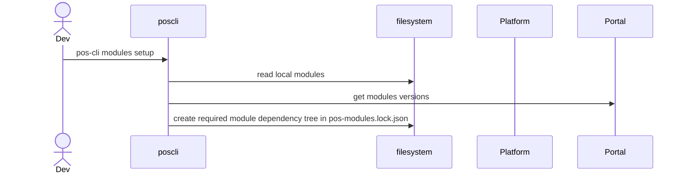
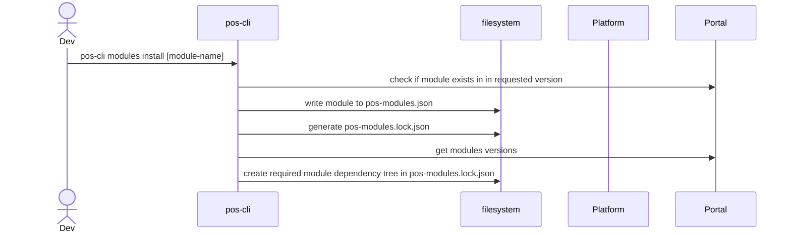
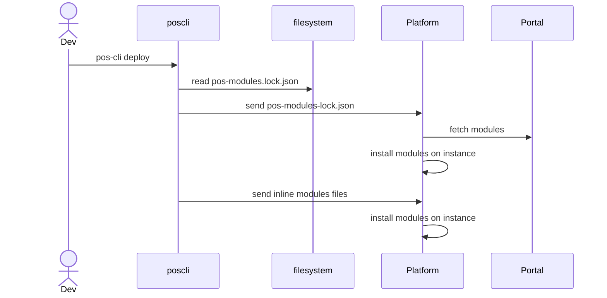

# Modules

## modules setup

```mermaid
sequenceDiagram
    actor Dev
    participant poscli
    participant filesystem
    participant Platform
    participant Portal
    Dev->>poscli: pos-cli modules setup
    poscli->>filesystem: read local modules
    poscli->>Portal: get modules versions
    poscli->>filesystem: create required module dependency tree in pos-modules.lock.json
```

## maybe modules install

```mermaid
sequenceDiagram
    actor Dev
    participant pos-cli
    participant filesystem
    participant Platform
    participant Portal
    Dev->>pos-cli: pos-cli modules install [module-name]
    pos-cli->>Portal: check if module exists in in requested version
    pos-cli->>filesystem: write module to pos-modules.json
    pos-cli->>filesystem: generate pos-modules.lock.json
    pos-cli->>Portal: get modules versions
    pos-cli->>filesystem: create required module dependency tree in pos-modules.lock.json
```

## modules deploy

```mermaid
sequenceDiagram
    actor Dev
    participant poscli
    participant filesystem
    participant Platform
    participant Portal
    Dev->>poscli: pos-cli deploy
    poscli->>filesystem: read pos-modules.lock.json
    poscli->>Platform: send pos-modules-lock.json
    Platform->>Portal: fetch modules
    Platform->>Platform: install modules on instance
    poscli->>Platform: send inline modules files
    Platform->>Platform: install modules on instance
```
