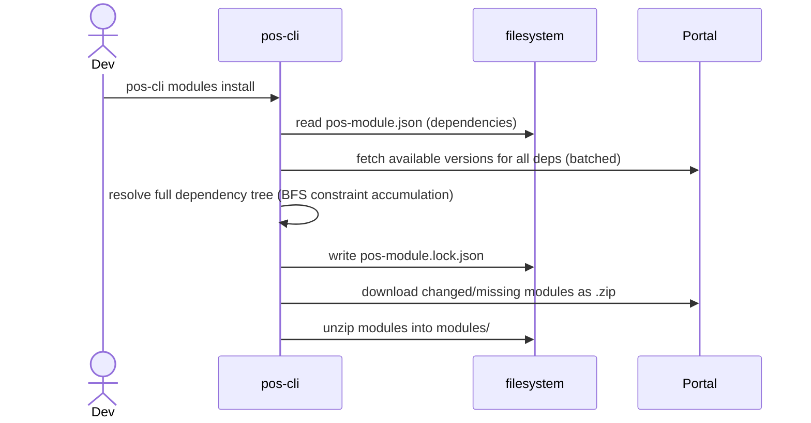
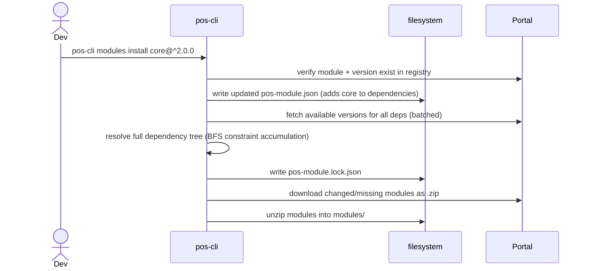
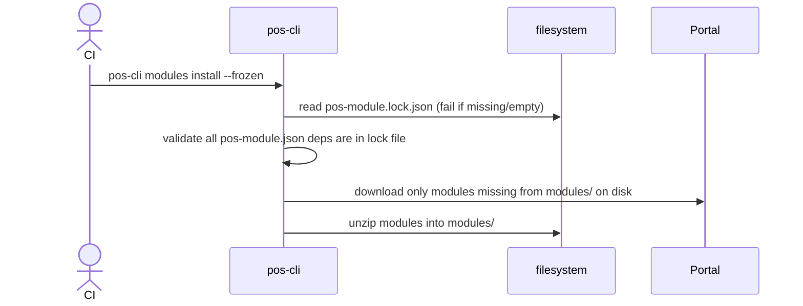
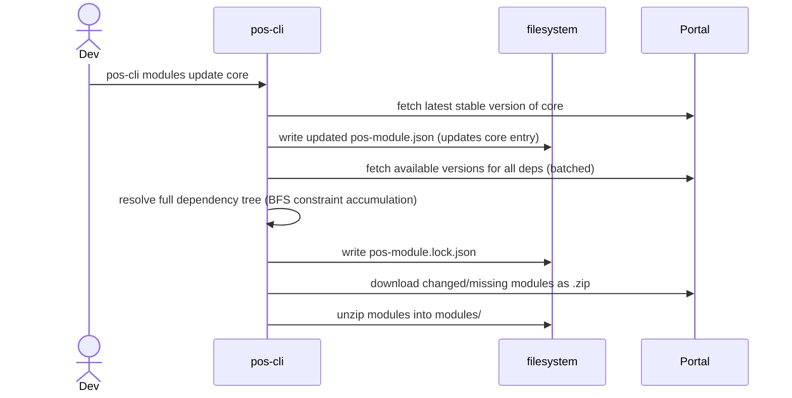
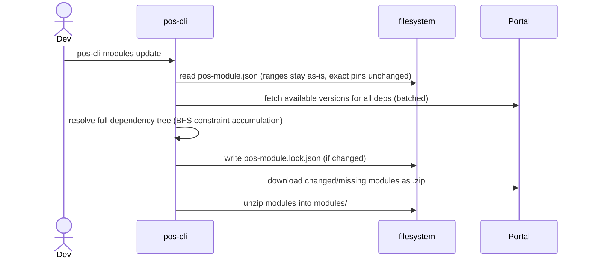
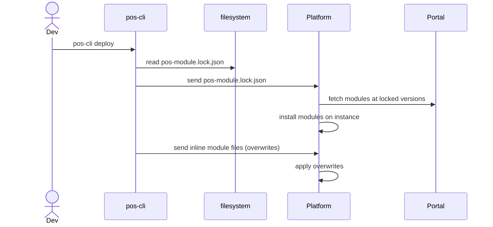

# Modules

## modules install (no arguments)

Reads `pos-module.json`, resolves the full dependency tree, writes `pos-module.lock.json`, and downloads all modules.



## modules install \<module-name\>

Adds a new module to `pos-module.json`, resolves the full dependency tree, and downloads all modules.



## modules install --frozen (CI mode)

Skips resolution entirely. Uses `pos-module.lock.json` as the sole source of truth. Downloads only what is missing from disk. No registry calls for resolution — only downloads.



## modules update \<module-name\>

Updates a single module. Resolves the full dependency tree and downloads changed modules.



## modules update (no arguments)

Re-resolves all range constraints to the best available version. Exact-pinned entries are left unchanged (use `pos-cli modules update <name>` to bump a specific pin).



## modules deploy (push to instance)



## Post-install messages (module authors)

A module may ship **declarative** setup instructions that pos-cli prints after the module is downloaded — for example, "run this generator next". This is the platformOS analogue of RubyGems' `post_install_message` and Homebrew's `caveats`.

These messages are **text only**. pos-cli never executes module-supplied code at install time (the npm `postinstall` supply-chain hole we are deliberately avoiding). If a module needs a command run, it prints the command for the user to copy.

Declare a message in the module's own `pos-module.json` (the one that ships in the archive, at `modules/<name>/pos-module.json`):

```json
{
  "machine_name": "common-styling",
  "postInstall": {
    "message": "common-styling installed.\n\nScaffold a layout:\n\n  pos-cli generate run modules/common-styling/generators/install\n"
  }
}
```

For longer instructions, omit `postInstall.message` and ship a `modules/<name>/POST_INSTALL.md` file instead — it is used as a fallback and also renders on the marketplace.

Rules:

- Messages are printed for modules **downloaded** during a run (including transitive dependencies installed for the first time), plus the explicitly named module on `pos-cli modules install <name>` (even when already present).
- `--frozen` (CI) installs print nothing.
- Module-supplied text is sanitised before printing: ANSI/OSC escape sequences (via `strip-ansi`) and bare control characters are stripped, and the message is length-capped.
- Re-view a module's message any time with `pos-cli modules show <name>` (when the module is installed locally).
