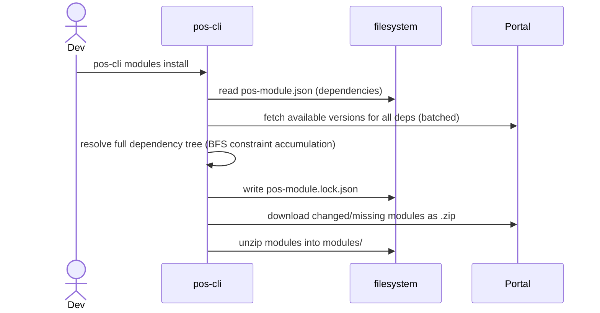
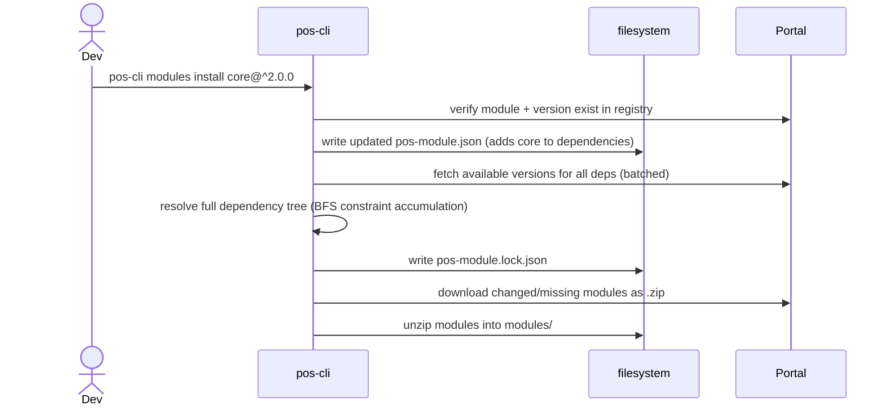
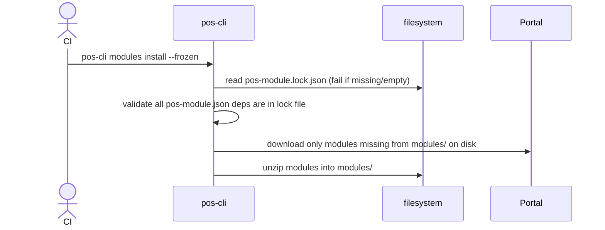
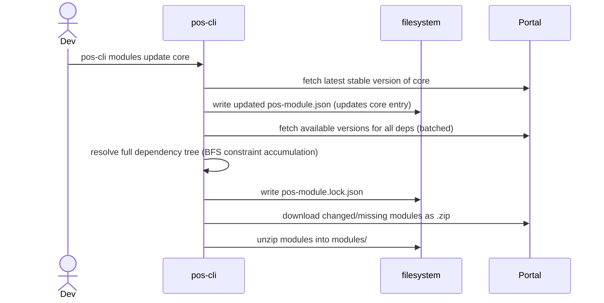
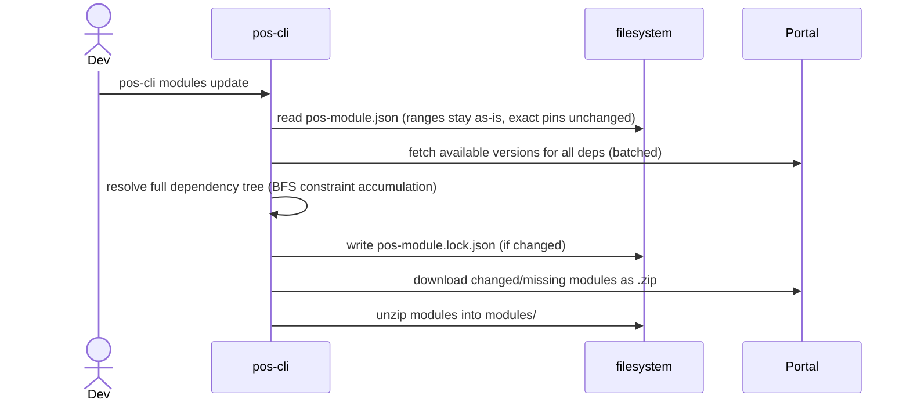
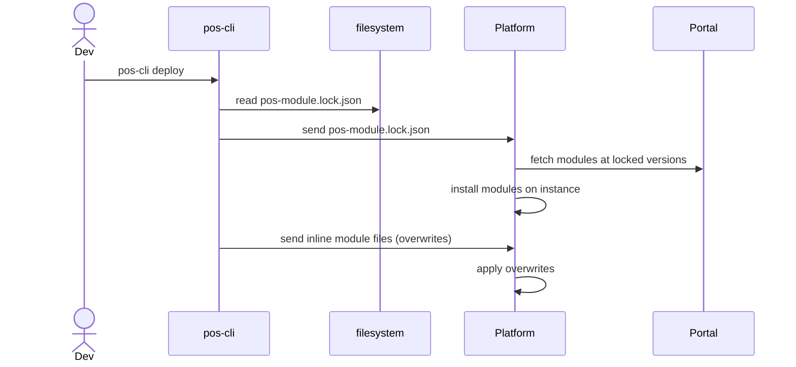

# Modules

## modules install (no arguments)

Reads `pos-module.json`, resolves the full dependency tree, writes `pos-module.lock.json`, and downloads all modules.

## modules install \<module-name\>

Adds a new module to `pos-module.json`, resolves the full dependency tree, and downloads all modules.

## modules install --frozen (CI mode)

Skips resolution entirely. Uses `pos-module.lock.json` as the sole source of truth. Downloads only what is missing from disk. No registry calls for resolution — only downloads.

## modules update \<module-name\>

Updates a single module. Resolves the full dependency tree and downloads changed modules.

## modules update (no arguments)

Re-resolves all range constraints to the best available version. Exact-pinned entries are left unchanged (use `pos-cli modules update <name>` to bump a specific pin).

## modules deploy (push to instance)

