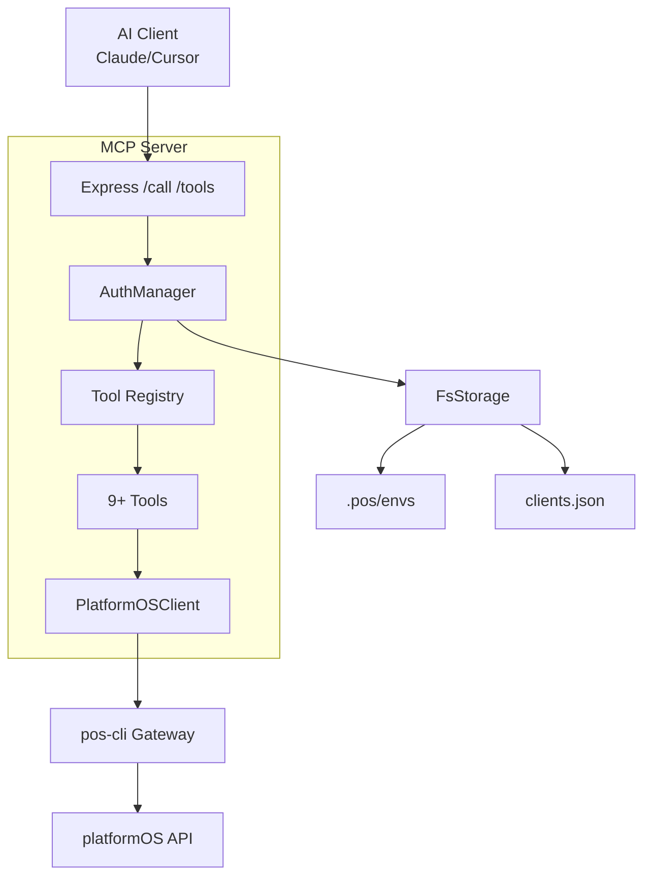

# platformOS MCP Server - Complete Documentation

[](https://www.npmjs.com/package/@platformos/mcp)
[](https://github.com/platformos/mcp/actions)
[](LICENSE)

## Overview

Model Context Protocol (MCP) server providing secure access to platformOS APIs through AI-compatible tools. 
Built on top of pos-cli library for direct API integration without subprocesses.

### Key Features
- **9+ Tools**: Environment management, GraphQL execution, Liquid rendering, data export, logs, modules, migrations, constants
- **Secure Auth**: ADMIN_API_KEY + client tokens via `clients.json`
- **Zod Validation**: Strict input/output schemas
- **TypeScript**: Full types and IDE support
- **Tested**: Unit/integration tests with 90%+ coverage

## 🚀 Quick Start

```bash
# Clone & install
git clone <repo>
cd mcp
npm ci

# 1. Set admin key
export ADMIN_API_KEY=your-super-secret-key

# 2. Add client (edit clients.json)
echo '{\"default\":{\"token\":\"client-secret\",\"name\":\"AI Client\"}}' > clients.json

# 3. Seed environment (.pos/envs/staging.json)
mkdir -p .pos/envs
cat > .pos/envs/staging.json << 'EOF'
{
  \"url\": \"https://staging.example.platformos.net\",
  \"account\": \"your-account\",
  \"email\": \"user@account.com\",
  \"token\": \"your-api-token\"
}
EOF

# 4. Start server
npm run dev
```

**Server ready at http://localhost:3030**

## 📖 Full Documentation

| Document | Description |
|----------|-------------|
| [API.md](docs/API.md) | HTTP endpoints, auth, schemas |
| [TOOLS.md](TOOLS.md) | Complete tool reference w/ Zod schemas & curl examples |
| [DEPLOY.md](DEPLOY.md) | Docker, production setup |
| [CONTRIBUTING.md](CONTRIBUTING.md) | Development guidelines |
| [CHANGELOG.md](CHANGELOG.md) | Release notes |

## 🔧 API Endpoints

### Admin (x-api-key: $ADMIN_API_KEY)
```bash
curl http://localhost:3030/health -H \"x-api-key: $ADMIN_API_KEY\"
# => { \"status\": \"ok\", \"tools\": [...], \"toolCount\": 9 }
```

### Client Tools List (Bearer $CLIENT_SECRET)
```bash
curl http://localhost:3030/tools -H \"Authorization: Bearer client-secret\"
```

### Execute Tool
```bash
curl -X POST http://localhost:3030/call \\
  -H \"Authorization: Bearer client-secret\" \\
  -H \"Content-Type: application/json\" \\
  -d '{\"tool\":\"platformos.env.list\",\"input\":{}}'
```

## 💻 Examples

See [examples/](examples/) for Node.js & Python MCP clients:

```bash
npm run example:node    # mcp-client.js
npm run example:python  # python-client.py
```

## 🏗️ Architecture



## NPM Scripts

| Command | Description |
|---------|-------------|
| `npm run dev` | Start with nodemon |
| `npm run build` | TypeScript build |
| `npm start` | Production |
| `npm test` | Run tests |
| `npm run lint` | ESLint check |

## pos-cli Integration

This MCP server reuses pos-cli's `lib/apiWrappers` and Gateway directly - no subprocess spawning.

**Reference**: [pos-cli lib structure](https://github.com/platformos/pos-cli/tree/main/lib)

## Next Steps

1. Integrate with Claude Desktop / Cursor AI
2. Add remaining tools (deploy, modules sync)
3. Kubernetes deployment manifests
4. OpenAPI spec generation

---
*Built with ❤️ for platformOS developers*
","path":"mcp/README.md